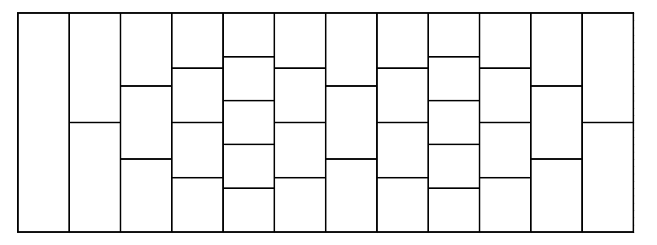

# 2021-01-14~

## **CF1450E**

### 题意

$n$ 个人每人有一个权值 $a_i$，同时有 $m$ 个下列两种关系：

- $a_i = a_j+1$。
- $|a_i-a_j|=1$。

求是否存在合法的序列 $a_1,a_2,\cdots,a_n$，若存在，最大化 $\max\limits_{1 \leq i \leq n} a_i - \min\limits_{1 \leq i \leq n} a_i$。($1\le n\le 200$，$n-1\le m\le 2000$)

### 题解

首先原图的基础图必然是二分图，因为相邻两个人的权值相差为 $1$，如果不是二分图直接无解。

如果是二分图，那么第一个关系等价于 $a_i \ge a_j + 1 \land a_i \le a_j+1$，第二个关系先写为 $a_i-a_j \le 1 \land a_j-a_i \le 1$。之后跑 floyd 差分约束，如果任意 $d_{i,i} < 0$ 说明有负环，否则任意两点间距离的最大值即为 $\max\limits_{1 \leq i \leq n} a_i - \min\limits_{1 \leq i \leq n} a_i$ 的最大值，即 $a_i - a_j \le x$。

注意到上述第二个关系并不完全等价，但是建图中每条边都是非 $0$ 的，若有 $d_{i,j} = 0 \Rightarrow a_i=a_j$，则说明有另一条长度为偶数的路径，再加上这一条边形成了一个奇环，与原图是二分图矛盾，从而该做法是正确的。

## **CF1473F**

### 题意

给定序列 $a_1, a_2, \cdots, a_n$，和 $b_1, b_2, \cdots, b_n$，需要选择 $1,2,\cdots,n$ 的一个子集 $S$，满足如果 $i \in S$，则 $\forall (j < i \land a_j \mid a_i),j \in S$ ，求 $\sum_{i\in S}b_i$ 的最大值。($1 \le n \le 3000$，$1 \le a_i \le 100$，$-10^5 \le b_i \le 10^5$)

本题空间限制 **32MB**。

### 题解

最大权闭合子图，直接跑边数 $O(n^2)$ 存不下，注意到 $a_i$ 最大只有 $100$，且如果 $k < j < k,a_j \mid a_i,a_j=a_k$，则如果选 $i$ 必然选 $j$，由 $j$ 的限制必选 $k$，从而只需要连边 $i \to j$，这样每个点最多连出去因子个数条边，从而可以通过本题。

## **CF1473G**

### 题意

给出一个地板图，每列宽度相同，由数个长度相同的瓷砖组成。第一列有 $1$ 个瓷砖，之后：

- 有 $a_1$ 列比前一列多一个瓷砖，接着有 $b_1$ 列比前一列少一个瓷砖。
- 有 $a_2$ 列比前一列多一个瓷砖，接着有 $b_2$ 列比前一列少一个瓷砖。
- ...
- 有 $a_n$ 列比前一列多一个瓷砖，接着有 $b_n$ 列比前一列少一个瓷砖。

可以见下面的图：

保证任意时刻瓷砖数量为正，现在你在第一个瓷砖，每次可以到下一列一个与当前瓷砖边界相交的瓷砖，问到最后一行瓷砖有多少种方案，对 $998244353$ 取模。($1 \le n \le 1000$，$1 \le a_i, b_i \le 10^5$，$|a_i - b_i| \le 5$)

### 题解

首先因为相邻两列只差一个，每次只能移动到下一列的 2 个（或 1 个，如果在边界且在减少），这等价于平面直角坐标系中 $(i,j)$ 移动到 $(i,j+1)$ 和 $(i+1,j)$，即每一列相当于是一条对角线。

我们考虑每一对 $a_i$ 和 $b_i$，设 $m = 1+\sum\limits_{j=1}^{i-1}(a_j-b_j)$，相当于从第 $m$ 个对角线的第 $1$ 到 $m$ 个点的方案数已知，只能向上或向右移动，到第 $m+a_i-b_i$ 条对角线的第 $1+b_i$ 到 $m+a_i-b_i-b_i$ 个点的方案数。两者的编号都从 $1$ 开始编号，则从第 $j$ 个点到第 $k$ 个点的方案数即为 $\dbinom{a_i+b_i}{b_i+k-j}$。

使用 NTT 卷积 $n$ 次即可，因为 $|a_i - b_i| \le 5$ ，所以每次有意义的项数在 $O(n)$ 级别，时间复杂度为 $O(n^2\log n)$。

需要的注意是，$k - j$ 可以是负数，所以我们可以直接让组合数对应的多项式整体增大偏移五位，最后答案再减小偏移五位即可。

## **CF1476F**

### 题意

有 $n$ 个灯，每个灯有一个照明度 $p_i$，可以向左照或向右照明，向左则可以照明 $[i-p_i,i-1]$，向右则可以照明 $[i+1,i+p_i]$，求一种方案让所有灯都被照亮，或判断无解。($1 \le n \le 3\times 10^5$)

### 题解

设 $f_i$ 是用前 $i$ 个灯能照亮的最大前缀长度，考虑如何转移：

- 如果这个灯向左照，那么想要和前面接上，必须从一个 $f_i \ge i-p_i-1$ 的位置转移，可以用线段树维护所有 $f_i$ 相同的值中最小的下标值，从而可以快速找到这个位置。转移时，中间的所有灯必然向右照，可以用 ST 表维护区间最大值，同时如果 $i$ 这个位置是向右的，那么也要和它的范围取最大值，如果是向左的则不用考虑。
- 如果这个灯向右照，那么如果 $f_{i-1} < i$，前缀没接上，因此直接将 $f_{i-1}$ 的值传下去即可；否则为 $\max(f_{i-1},i+p_i)$。

需要注意的是即使 $f_{i-1} \ge i$ 也是有可能向左照明的，因为这可能让左边的一个很亮的灯改为向右照明。

输出方案时只需记录每个灯的转向即可，要注意如果一个灯左右转能照亮的前缀相同，那么肯定选择右转。

## **CF1476G**

### 题意

给定长度为 $n$ 的序列，$m$ 个下列两种操作：

- 给定 $l,r,k$，询问区间 $[l,r]$ 中选 $k$ 个不同的数，它们出现次数最大值与最小值之差的最小值是多少；或判断不能选出 $k$ 个不同的数。
- 更改一个位置的数。

($1 \le n, m \le 10^5$)

### 题解

盲猜带修莫队，但是发现到了某个区间时，询问不太好处理。

这里用到了 $n$ 个数每种数出现次数所组成的集合大小不超过 $O(\sqrt{n})$ 这个性质，可以直接维护所有数出现次数排序过后的序列，当一个数增加时，设其数量为 $x$，而这个序列中所有 $x$ 必然是连续的，因此只需将最右侧的 $x$ 改为 $x+1$ 即可；一个数减少只需将最右侧的 $x$ 改为 $x-1$ 即可。这样每次修改都是 $O(1)$，到一个区间处理询问时，只需在上述过程中额外维护的每个连续的数的左边界和右边界，就可以 $O(\sqrt {n})$ 利用双指针得到最小值。

每个块大小为 $O(n^{\frac{2}{3}})$，总时间复杂度 $O(n^{\frac{5}{3}}+m\sqrt{n})$。

## **CF1477D**

### 题意

给定 $m$ 对无序关系 $(l_i,r_i)$，构造两个长度为 $n$ 的排列 $p_1,p_2,\cdots,p_n$ 和 $q_1,q_2,\cdots,q_n$，满足 $\forall i \in [1,m],(p_{l_i}-p_{r_i})(q_{l_i}-q_{r_i})>0$。同时要求最小化 $p_i \ne q_i$ 的个数。

($1 \le n \le 5 \times 10^5$，$0 \le m \le \min \left(\dfrac{n(n-1)}{2},5 \times 10^5\right)$)

### 题解

考虑对于 $m$ 对关系建图，如果一个点的度数为 $n-1$，那么它与其它 $n-1$ 个位置的大小关系是确定的，因此在两个排列中该位置的值必然相等。下面通过构造证明除了上述这些点对应的位置，其它位置都可以不同：

如果我们能将剩下的位置划分为数个不相交的集合，每个集合 $S$ 满足 $\exists  i \in S,\forall j \in S$，$(i,j)$ 不在给定的 $m$ 对关系中。那么可以设 $S$ 中的位置分别为 $j_1,j_2,\cdots,j_{|S|-1},i$，我们在第一个排列中给这些位置赋值 $1,2,\cdots,|S|-1,|S|$，在第二个排列中给他们赋值 $2,3,\cdots,|S|,1$，因为 $i$ 与其它位置都没有关系，而其它位置之间的大小关系不变，从而这个集合内位置之间的满足条件的。对于多个集合之间的关系，我们只要将值连续地赋给它们（即第一个集合的值域为 $[1,|S_1|]$，第二个集合的值域为 $[|S_1|+1,|S_1|+|S_2]$），就可以保证多个集合之间的关系也满足条件。

考虑如何找到上述的划分。首先建出补图中随便一个生成树，可以对 $[2,n]$ 中每个点求所有和它相连点对应集合的 $\operatorname{mex}$ 来 $O(n+m)$ 实现。接下来只需将整棵树划分为数个大小超过 $1$ 的菊花图即可，让中间的点当作上述中的 $i$ 即可。考虑遍历每个点：

- 如果这个点已经在一个菊花图中，则跳过。
- 如果这个点不在一个菊花图中，随便找一个它相邻的点 $x$。如果 $x$ 不在一个菊花图中，那么让 $x$ 成为菊花图的中心，将周围所有未在菊花图中的点都拉入它的图；如果 $x$ 在菊花图中，那么它一定不是中心（否则这个点就会在菊花图中），如果对应菊花图的大小为 $2$，则直接将中心改为 $x$，将周围所有未在菊花图中的点都拉入它的图；否则直接让 $x$ 脱离原来的菊花图，重新成为一个中心，也将周围所有的未在菊花图中的点都拉入它的图。

## **CF1481E**

### 题意

$n$ 本书，每本书有一个颜色 $a_i$，每次操作可以将任意一本书放到最右侧，问使得每种颜色的书都连续放在一起最少需要操作多少次。($1 \le n \le 5 \times 10^5$)

### 题解

设 $f_{i}$ 是 $[i,n]$ 中最多保留多少本书不动，则有以下三个转移：

- $f_{i+1} \to f_i$，即移动第 $i$ 本书。
- 若 $i$ 是颜色 $a_i$ 的所有书中最靠左的，设 $r_{a_i}$ 是该颜色最靠右的书，那么可以选择把保留所有颜色为 $a_i$ 的书，移动中间夹着的其它书，即 $f_{r_{a_i}+1}+\textit{cnt}_{a_i} \to f_i$，其中 $\textit{cnt}_{a_i}$ 是颜色为 $a_i$ 书的数量。
- 若 $i$ 不是颜色 $a_i$ 的所有书中最靠左的，那么也我们可以选择保留所有颜色为 $a_i$ 的书，但此时因为左边还有相同颜色的书，我们需要先把左边的颜色为 $a_i$ 的书移到最右侧，然后再把中间夹着的书移出去。因此这样所有 $[i,n]$ 中颜色不为 $a_i$ 的书都要被移动，即 $\textit{tot}_{a_i} \to f_i$，其中 $\textit{tot}_{a_i}$ 是 $[i,n]$ 中颜色为 $a_i$ 书的数量，这个值可以随着 dp 的进行而逐步增加。

上述三者取 $\min$ 即可，时间复杂度为 $O(n)$。

## **CF1481F**

### 题意

给定一棵 $n$ 个节点的树，$1$ 号节点为根，你需要将 $x$ 点标为 $\text{a}$，剩下 $n-x$ 个点标为 $\text{b}$。对于每个节点，它所代表的字符串即为从根节点到该节点路径上所有节点上字母按顺序组成的字符串，最小化 $n$ 个字符串中本质不同的数量。($1 \leq n \leq 10^5$，$0 \leq x \leq n$)

### 题解

设 $d$ 为最深点的深度，则答案的下界为 $d+1$，设 $a_i$ 为深度为 $i$ 的节点的个数 ($i \in [0,d]$)，那么如果 $a_0,a_1,\cdots,a_d$ 选出一部分的和为 $x$，即可达到下界，相当于每层的颜色都一样，显然答案为 $d+1$。这转化为了一个 $\text{01}$ 背包问题，且所有物品容量之和为 $n$，那么每种物品的容量最多有 $O(\sqrt n)$ 种不同取值，转化为多重背包问题，使用队列即可优化到 $O(n\sqrt n)$。但是这个模型有更快的解法，考虑使用二进制分组，可以证明总物品数量是 $O(\sqrt n)$ 级别的：

> 设 $\textit{cnt}_i$ 是容量为 $i$ 的物品个数，容易得到满足 $cnt_i \ge 2^k$ 的 $i$ 至多有 $\sqrt{\dfrac{n}{2^{k-1}}}$ 个（当 $k=0$ 时则是经常使用的结论”所有物品容量之和为 $n$，那么每种物品的容量最多有 $O(\sqrt n)$ 种不同取值“）。
>
> 那么二进制分组后的总物品数量即为：
> 
> $$
> \begin{aligned}
> &\sum _{i=1} ^ n [\textit{cnt}_i > 0]\Big(\lfloor\log_2(\textit{cnt}_i)\rfloor+1\Big)\newline
> =&\sum_{k=0}^{+\infty} \sum _{i=1} ^ n [cnt_i \ge 2^k]\newline
> \le&\sum_{i=0}^{+\infty} \sqrt{\frac{n}{2^{i-1}}} \newline
> =&O(\sqrt{n})
> \end{aligned}
> $$
> 
> 其中第一步的等式相当于若 $\lfloor\log_2(\textit{cnt}_i)\rfloor = k$，则 $\Big(\lfloor\log_2(\textit{cnt}_i)\rfloor+1\Big)$ 的值会被 $[cnt_i \ge 2^0],[cnt_i \ge 2^1],\cdots,[cnt_i \ge 2^k]$ 处统计到。

再使用 bitset 优化 $\text{01}$ 背包，则时间复杂度为 $O(\dfrac{n\sqrt n}{w})$。

考虑如果上述情况无解，考虑按深度从小到大一层一层填字母。设 $\text{a}$ 还剩 $x$ 个，$\text{b}$ 还剩 $y$ 个，如果这一层还可以的数量不超过 $x$ 或 $y$，就填其中一中颜色，直到某一层颜色大于 $\max(x,y)$。此时，可以发现这一层的非叶节点数量一定不超过剩余节点总数的一半，因为每个非叶节点在下层至少还有一个儿子节点。因此我们一定可以用剩余字母更多的那一种（不妨设为 $\text{a}$）将所有非叶节点填满，之后再把剩余的 $\text{a}$ 全部填到这一层的叶节点上，之后剩下所有的节点全部填 $\text{b}$ 即可。可以发现这样填涂后的答案为 $d+2$，因为相比答案为 $d+1$ 的情况，仅仅多了在上述这一层中所有叶节点对应的字符串。

## **ARC106F**

### 题意

$n$ 个点，第 $i$ 个点有 $a_i$ 个接口，每条边可以连接两个接口，每个接口只能用一次，问有多少种不同的生成树。两个生成树相同当且仅当它们用的接口都一样且每对接口间连边情况相同。($1 \le n \le 2 \times 10^5$)

### 题解

枚举每个点的度数，由 prufer 序列的性质可以确定每个点出现的次数，则答案为：

$$
\sum_{\sum \limits _{i=1}^nd_i=2n-2}\binom{n-2}{d_1-1,d_2-1,\cdots,d_n-1} \prod_{i=1}^n A_{a_i}^{d_i}
$$

设生成函数：

$$
\begin{aligned}
f_{a}(x) =& \sum_{i=1}^{+\infty}\frac{1}{(i-1)!}A_{a}^ix^i \newline
=& \sum_{i=1}^{+\infty}\frac{a!}{(i-1)!(a-i)!}x^i \newline
=& a\sum_{i=1}^{+\infty}\frac{(a-1)!}{(i-1)!(a-i)!}x^i \newline
=& a\sum_{i=1}^{+\infty}\binom{a-1}{i-1}x^i \newline
=& ax\sum_{i=0}^{+\infty}\binom{a-1}{i}x^i \newline
=& ax{(x+1)}^{a-1} \newline
\end{aligned}
$$

则答案为：

$$
\begin{aligned}
& [x^{2n-2}](n-2)!\prod_{i=1}^nf_{a_i}(x) \newline
=& [x^{2n-2}](n-2)!\prod_{i=1}^na_ix(x+1)^{a_i-1} \newline
=& [x^{2n-2}](n-2)!x^n\prod_{i=1}^na_i(x+1)^{a_i-1} \newline
=& [x^{n-2}](n-2)!\prod_{i=1}^na_i(x+1)^{a_i-1} \newline
=& [x^{n-2}](n-2)!\left(\prod_{i=1}^na_i\right)(x+1)^{\left(\sum \limits _{i=1}^na_i\right)-n} \newline
=& (n-2)!\left(\prod_{i=1}^na_i\right)\binom{\left(\sum \limits _{i=1}^na_i\right)-n}{n-2} \newline
=& \left(\prod_{i=1}^na_i\right)\frac{\left[\left(\sum \limits _{i=1}^na_i\right)-n\right]!}{\left[\left(\sum \limits _{i=1}^na_i\right)-2n+2\right]!}
\end{aligned}
$$
