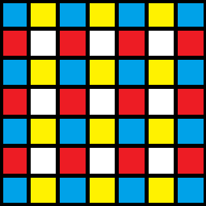

---
hide:
  - toc
---

# 2021-05-06~2021-07-16

## **CF1083C**

### 题意

$n$ 个点的树，节点上的权值是一个排列，有 $q$ 次以下两种操作：

- 交换两个点的权值。

- 求所有路径上点构成 $\operatorname{mex}$ 的最大值。

($2 \le n \le 2 \times 10^5$，$1 \le q \le 2 \times 10^5$)

### 题解

设 $d(x,y)$ 是 $x,y$ 两点间距离，$b$ 在 $a,c$ 路径上的条件是 $d(a,b)+d(b,c)=d(a,c)$。

利用这个条件维护权值线段树，区间 $[l,r]$ 即权值在这个区间的点是否都在一条路径上，如果是则维护其两个端点。

修改操作直接修改即可，查询操作在线段树上进行二分，找到最长的前缀满足其构成一条路径即可，时间复杂度 $O(q\log n)$。

## **CF1313D**

### 题意

$n$ 个魔法，$m$ 个小朋友，每个魔法可以让 $[L_i,R_i]$ 中的小朋友获得一颗糖，每个魔法可以选择用或者不用，问最多能让多少个小朋友获得奇数个糖。保证就算所有魔法都用了，每个小朋友至多获得 $k$ 个糖。($1 \le n \le 10^5$，$1 \le m \le 10^9$，$1 \le k \le 8$)

### 题解

离散化后每个点最多被 $k$ 个区间覆盖，可以使用状压 dp，为当前覆盖该点的所有区间编个号并用二进制表示是否释放，这样就知道离散化后每个点是否会被覆盖奇数次，每个区间是否释放时要在左端点决定。

时间复杂度为 $O\left(n\left(\log n + 2^k\right)\right)$。

## **CF1313E**

### 题意

给定三个字符串 $a,b,s$，问有多少个 $[l_1,r_1],[l_2,r_2]$ 满足：

- $[l_1,r_1],[l_2,r_2]$ 相交。
- $a[l_1,r_1]b[l_2,r_2]=s$。

($1 \le |a|,|b| \le 5 \times 10^5$，$2 \le |s| \le 2n$)

### 题解

使用扩展 KMP 求出 $a$ 的每个后缀和 $s$ 的 LCP，以及 $b$ 的每个前缀和 $s$ 的 LCS。对于第 $i$ 个前缀或后缀，分别记为 $A_i$ 和 $B_i$。

对于一对 $A_i$ 和 $B_j$，它们能构成一组解当且仅当：

- $A_i + B_j \ge |s|$。
- $i \le j \le i + |s| - 1$。

且这样的解的个数恰好为 $A_i + B_j - |s| + 1$。

因此从小到大枚举 $A_i$，依次添加符合条件的 $B_i$，并使用树状数组维护第二个条件即可，时间复杂度为 $O(|b| \log n)$。

## **CF1326F**

### 题意

给出一个 $n$ 个点无向图的邻接矩阵，对于一个 $1$ 到 $n$ 的排列 $a_1,a_2,\cdots,a_n$，按如下方式生成一个长度为 $n-1$ 的 $\texttt{01}$ 串 $b_1b_2\cdots b_{n-1}$：

- 如果 $a_i$ 和 $a_{i+1}$ 之间有边，则 $b_i=\texttt{1}$，否则 $b_i=\texttt{0}$。

问对于 $2^{n-1}$ 个 $\texttt{01}$ 串，分别有多少个排列能生成它们。($2 \le n \le 18$)

### 题解

考虑将条件改为：

- 如果 $b_i=\texttt{1}$，则  $a_i$ 和 $a_{i+1}$ 之间有边。

这样求出来答案后 $i$ 的答案会包含在它的所有子集中，因此再做一遍 AND 的 IFWT 即可。

条件更改后，每个二进制串即对应图中数条链，且链与链之间相互独立不需要考虑首尾是否相连。

因此，每个二进制串对应的方案数只与将 $n$ 个节点分为数个链所代表的分拆数有关，而 $p_{18}=385$。

先使用状压 dp 求出每个子集有多少对应的链，设 $g_{i,j}$ 为当前集合为 $i$ 末尾为 $j$ 的链的方案数，$O(n)$ 转移，时间复杂度为 $O(n^22^n)$。

求出 $i$ 个元素组成的子集对应的链数量的数组 $f_i$，有 $f_{i,j} = \sum \limits _{\operatorname{popcount}(k)=i}\sum \limits _{l \in k}g_{k,l}$，对每个 $f_i$ 数组做 OR 的 FWT。

枚举每一种分拆方案，将对应的 $f_i$ 数组乘起来，做一遍 OR 的 IFWT，第 $2^n-1$ 项即为对应的方案数。注意到一共只有 $n$ 个 $\texttt{1}$，因此如果方案中有交最后肯定不能变为全 $\texttt{1}$，从而不需要使用子集卷积。

最后枚举 $0$ 到 $2^n-1$，通过其分拆方案得到其对应的方案数，做一遍 AND 的 IFWT 得到答案。

总时间复杂度为 $O\left(2^n\left(p_n+n^2\right)\right)$。

## **CF1515H**

### 题意

维护一个数据结构，初始有 $n$ 个数 $a_1,a_2,\cdots,a_n$，需要支持 $q$ 次以下四种操作之一：

- 将 $l_i \le a_i \le r_i$ 的所有 $a_i$ 变成 $a_i$ AND $x$。
- 将 $l_i \le a_i \le r_i$ 的所有 $a_i$ 变成 $a_i$ OR $x$。
- 将 $l_i \le a_i \le r_i$ 的所有 $a_i$ 变成 $a_i$ XOR $x$。
- 询问有多少个不同的 $a_i$ 满足 $l_i \le a_i \le r_i$。

($1 \le n \le 2 \times 10^5$，$1 \le q \le 10^5$，$0 \le a_i,x,l_i,r_i < 2^{20}$)

### 题解

设全集 $S=2^{20}-1$，异或 $S$ 等价于取反，因此可以通过 OR 和 XOR 操作实现 AND，下面只考虑 OR 和 XOR 这两种操作：

维护一个 $\texttt{01}$ Trie，维护每个节点对应的子树中叶子节点的数量 (因为题目中问的是不同的 $a_i$)，同时支持合并和分裂，可以取出对应区间的 Trie，原理和方法与线段树合并 / 分裂完全相同。

XOR 操作直接在分裂出来的树根打异或标记即可。

OR 操作则需要从根开始进行递归，如果 $x$ 这一位是 $\texttt{1}$ 则直接将左子树合并到右子树并删掉左子树，递归右子树；否则直接递归左右子树。直接这样做复杂度肯定是错误的，我们需要记录每个子树中每一位是否全是 $\texttt{0}$ 以及每一位是否全是 $\texttt{1}$，如果 $x$ 是 $\texttt{1}$ 的位在子树中要么全是 $\texttt{0}$ 要么全是 $\texttt{1}$，我们就可以用一个异或标记来取代继续递归，只需将那些全是 $\texttt{0}$ 的位进行异或即可。

上述信息的维护比较简单，唯一需要注意的是异或时两者也会跟着变化，需要进行一下讨论，不过依旧是按位运算，可以 $O(1)$ 完成。

这样做的时间复杂度为 $O\left((n+q) \log ^2 n\right)$，简单证明如下：

> 初始节点数 $O(n \log n)$，单次分裂操作至多增加 $O(\log n)$ 个节点，其它操作不会新增节点，因此总节点数不超过 $O\left((n+q)\log n\right)$。
>
> 合并操作中，如果继续递归没有终止那么必然会让一个节点永远消失，从而时间复杂度不超过节点总数，即为 $O\left((n+q)\log n\right)$。
>
> OR 操作递归过程中，如果继续递归没有终止那么必然会在子树中发生节点的合并，也就是至少会让一个节点永远消失，那么最多发生 $O\left((n+q)\log n\right)$ 次，而每次额外花费的时间不超过从根节点走到该点的时间，即为树高 $O(\log n)$，因此总时间复杂度不超过 $O\left((n+q) \log ^2 n\right)$。

## **CF1515I**

### 题意

$n$ 种钻石，第 $i$ 种数量为 $a_i$、重量为 $w_i$、价值为 $v_i$，执行 $m$ 次以下三种操作之一：

- 增加一定数量的第 $i$ 种钻石。
- 减少一定数量的第 $i$ 种钻石。
- 拿一个容量为 $c$ 的背包，按照价值从大到小、价值相同按重量从小到大的顺序依次拿钻石所有能拿的钻石，直到背包放不下为止，问背包中所有钻石的价值是多少。

($1 \le n \le 2 \times 10^5$，$1 \le m \le 10^5$，$1 \le c \le 10^{18}$)

### 题解

物品种类是固定的，先按照题目要求将物品排序。

考虑不停让 $c$ 不停减半，设 $c$ 的最高位为 $2^k$，那么只需考虑所有最高位不超过 $2^k$ 的物品，我们设 $<2^{k}$ 的物品为轻物品，其它 $< 2^{k+1}$ 但 $\ge 2^k$ 的物品为重物品，显然只能购买一个重物品。

对于每个 $k$，线段树维护以下两类值：

- 区间内所有轻物品的重量和和价值和。
- 区间内重量和最小的「重物品 + 其前面的所有轻物品」。

这两类值都可以 $O(\log c)$ 合并。

考虑按如下方法在线段树上递归，同时不断维护 $c$ 及其最高位 $2^k$，以及拿走物品的价值和：

- 如果该节点是叶子节点，则直接进行处理，修改价值和以及 $c$。
- 如果该区间内所有物品的重量和不超过 $c$，这可以通过该节点 $k+1$ 对应的轻物品重量和来获取，则直接进行处理，修改价值和以及 $c$。
- 如果该区间内所有轻物品的重量和不超过 $c$，同时该区间内不存在一个重物品满足其「重物品 + 其前面的所有轻物品」的重量和不超过 $c$，则必然会将所有的轻物品拿光，因此直接进行处理，修改价值和以及 $c$。
- 否则，递归左右子树。

可以证明单次操作这样做的时间复杂度为 $O(\log c\log n)$：

> 只需证明最多发生 $O(\log c)$ 次递归左右子树。
>
> 递归左右子树一定是因为它不满足前面的三种情况：
>
> - 要么该区间内存在一个重物品满足其「重物品 + 其前面的所有轻物品」的重量和不超过 $c$，如果这个重物品在左子树，那么递归完左子树回来 $c$ 至少减少一半；如果在右子树，那么左子树必然满足轻物品重量之和不超过 $c$，直接终止递归，相当于没有发生递归左右子树。
> - 要么该区间内所有轻物品的重量和大于 $c$，且不存在上述的重物品，那么如果左子树满足轻物品重量之和不超过 $c$，直接终止递归，相当于没有发生递归左右子树；否则，递归完左子树回来 $c$ 至少减少一半，因为 $c$ 变得小于一个轻物品。
>
> 综上，要么只会往一个子树继续走，相当于没有发生递归左右子树；要么递归完左子树 $c$ 至少减少一半，因此最多发生 $O(\log c)$ 次递归左右子树。

因为单次修改操作的时间复杂度是 $O\left(\log n \log c\right)$，因此总时间复杂度为 $O(m\log n\log c)$。

一个 trick 是不需要将 $k$ 的最大值设为 $60$，只需保证 $2^k$ 大于所有物品的重量，因为 $k$ 再大所有物品都是轻物品，不需要维护很多一样的东西，维护 $c$ 的最高位时也默认和 $k$ 的最大值取 $\min$ 即可。

## **CF1521D**

### 题意

给定一棵 $n$ 个节点的树，每次可以删一条边再加一条边，问最少多少次能把树变成链。($2 \le n \le 10^5$)

### 题解

假设需要操作 $x$ 次，那么这等价于删掉 $x$ 条边使得每个连通块都是链。

考虑递归子树后贪心地删，设边 $(u,v)$ 其中 $u$ 是父亲，递归 $v$ 后：

- 如果 $v$ 有不多于 $1$ 个儿子，则不用再删。
- 如果 $v$ 有两个儿子，可以把 $(u,v)$ 删了，这样 $v$ 所在连通块就是一条链了。
- 如果 $v$ 有更多儿子，先把 $(u,v)$ 删了，再把 $v$ 的儿子删到只剩两个。

正确性在于尽可能地删掉和父亲相连的边，因为这可以同时让两个点减少多余的点。

## **CF1521E**

### 题意

有 $m$ 种数，第 $i$ 个数的数量为 $a_i$，需要构造一个最小的 $n \times n$ 矩阵，使得将所有数放置，允许一些位置为空，要求：

- 每个 $2 \times 2$ 的子矩阵不能全满。
- 每个 $2 \times 2$ 的子矩阵的对角线（包括主和副）要么不全满， 颜色不能相同。

($1 \le m, \sum a_i \le 10^5$)

### 题解

设 $k=\sum a_i$，$x = \max a_i$。

将矩阵划分为数个不相交的 $2 \times 2$ 的子矩阵，有 $n^2 - {\left\lfloor\dfrac{n}{2}\right\rfloor}^2 \ge k$；此外，考虑每个子矩阵里面最多有两个颜色相同，可以得到 $n \left\lceil\dfrac{n}{2}\right\rceil \ge x$。由此两者可以得到 $n$ 的下界，可以证明这个下界一定可以被构造出来：

按照如下从题解搬运的图片进行染色：

先将出现次数最多的那个数字填到红色上，如果红色的放不下，再往蓝色放，一定能放下因为红蓝总和即为 $n \left\lceil\dfrac{n}{2}\right\rceil$；如果红色格子数量比这个数字的数量多，那么再放次多的数字，直到红色被放下，多余的放蓝色上，蓝色的一定放得下因为蓝色数量不少于红色，而最多的数字数量也比红色格子少。

之后的数字随便填到蓝色和黄色上即可，任意两个红色和黄色上的数字都不会相同，因为按照上述方案，一个数字想要又出现在红色又出现在黄色，必然它也出现在蓝色，显然不可能。

## **CF1523E**

### 题意

$n$ 个台灯初始是关着的，每次随机一个关着的灯将其点亮，直到存在一个长度为 $k$ 的连续段使得有大于一个台灯亮着才停止。求期望开了多少灯。($2 \le k \le n \le 10^5$)

### 题解

从初始状态（所有灯都灭）到最后到达一个非法状态，这期间经过了数个合法状态。

期望开灯数量等于经过的（除初始状态的）合法状态的数量 $+1$ ，根据期望的线性性，这等于达到每种合法状态所贡献数量的期望，数量为 $1$，因此这等于达到每种合法状态的概率之和。

到达一个开了 $i$ 个灯的状态，有 $i!$ 种选灯方案，每次的概率乘积为 $\displaystyle \prod \limits _{i=n-i+1}^n \frac{1}{i}=\frac{(n-i)!}{i}$，因此概率为 $\dfrac{i!(n-i)!}{n!}=\dfrac{1}{\dbinom{n}{i}}$，而一个开了 $i$ 个灯的合法状态数量即为任意两个开着的灯距离均 $\ge k$ 的状态数量，由不定方程可以得其数量为 $\dbinom{n-ki+k}{i}$，从而可以枚举 $i$ 实现 $O(n)$ 求解。

## **CF1523F**

### 题意

二维平面上 $n$ 个传送门和 $m$ 个定时任务，一个传送门被激活后可以任意时刻瞬移过去，需要到那个位置才能激活。定时任务需要对应时刻恰好在那个位置，距离是走曼哈顿距离，问最多可以完成几个任务，$0$ 时刻可以选择位于任意一个位置。($0 \le n \le 14$，$1 \le m \le 100$)

### 题解

设 $f_{i,j}$ 为激活状态为 $i$ 且刚完成了任务 $j$ 的最大任务完成数量，$g_{i,j}$ 是激活状态为 $i$ 且完成了 $j$ 个任务的最小花费时间。预处理出 $a_{i,j}$ 表示集合 $i$ 中传送门到传送门 $j$ 的最短距离，$b_{i,j}$ 表示集合 $i$ 中传送门到任务 $j$ 的最短距离。

从小到大遍历 $i$，依次进行如下四个转移，所有转移都是取 $\max$：

- 如果 $g_{i,j} + b_{i,k}$ 不超过第 $k$ 个任务的时间，那么可以通过对应的传送门到这个任务，有 $f_{i,k} \gets j+1$。
- 如果第 $j$ 个任务地点到 $k$ 个任务地点的时间间隔不小于两者之间的曼哈顿距离，或不小于 $b_{i,k}$，即通过传送门过去，那么可以到第 $k$ 个任务，即 $f_{i,k} \gets f_{i,j}+1$。
- 从一个任务地点去激活传送门，设 $t$ 为第 $j$ 个任务的时间，$d$ 为第 $j$ 个任务地点和第 $k$ 个传送门间的曼哈顿距离，有 $g_{i \cup \{k\},f_{i,j}} \gets t + \min(d,a_{i,k})$。
- 从一个传送门去激活另一个传送门，$g_{i \cup \{k\},j} \gets g_{i,j} + a_{i,k}$。

为什么要按照这个顺序呢，可以看到前两个转移的 $i$ 是不变的，后两个转移 $i$ 一定会增大，且可能用到前两个转移的状态。此外，第一个转移是 $g$ 到 $f$，第二个转移是 $f$ 到 $f$，后者可能用到前者的状态，因此顺序不能反。

总时间复杂度为 $O\left(nm 2^n\right)$。

## **CF1523G**

### 题意

$n$ 个点和 $m$ 个区间覆盖，对于每个 $x=1,2,\ldots,n$，按照如下规则求出有多少个点被覆盖了：

- 依次处理每条线段，如果其长度 $>x$ 或区间内的点已经被其它区间覆盖了，则不覆盖，否则覆盖。

($1 \le n \le 5 \times 10^4$，$1 \le m \le 10^5$)

### 题解

考虑如下看似暴力的算法，从小到大遍历 $x$，每次将新增可行的区间插入到一个数据结构中，然后调用一个递归函数 $\text{solve}(L,R)$，内部逻辑为从数据结构中找到编号最小的 $L \le l \le r \le R$ 的区间 $[l,r]$，返回 $r-l+1+\text{solve}(L,l-1)+\text{solve}(r+1,R)$；如果不存在这样的区间则终止。

数据结构需要维护二维偏序最小值，支持插入和询问，第一维只有下界，是一个后缀，可以树状数组套动态开点线段树完成。

每次调用至少会进行一次覆盖，对于 $x=1,2,\ldots,n$ 总覆盖次数不超过 $\displaystyle \sum _{i=1}^n \frac{n}{i}=O(n \log n)$，从而总时间复杂度为 $O(n \log ^3n + m \log ^2 n)$。

## **CF1523H**

### 题意

$n$ 个点，每个点有一个权值 $a_i$，一次跳跃可以从点 $i$ 跳到 $[i,i+a_i]$。

$q$ 次询问，每次给定 $l,r,k$，求从 $l$ 跳到 $r$ 的最小次数。你可以删掉不超过 $k$ 个点，然后剩下点拼接在一起，每个点原本对应的 $a$ 不变，$l,r$ 不能被删掉。($1 \le n,q \le 2 \times 10^4$，$0 \le k \le 30$)

### 题解

先不考虑删点，那么每次一定会跳到跳过去后能跳范围更大的那个点，也即跳到的点 $i$ 要满足 $i+a_i$ 最大化。

设 $f_{i,j}$ 为从 $i$ 跳 $2^j$ 步会到哪个点，利用类似 ST 表的方法维护即可，每次取 $i+a_i$ 更大的那个点。

接着考虑删点，本质就是一次跳的时候往后多跳即可，设 $g_{i,j,k}$ 为从 $i$ 跳 $2^j$ 次删 $k$ 个点最远能跳到哪儿，转移类似 ST 表，不过内层需要再枚举 $k$ 和转移时 $k$ 的增量，即：
$$
g_{i,j,k} = \max _{l=0} ^ k g_{F(i, g_{i,j-1,l}),j-1,k-l}
$$
这里 $F(l,r)$ 即为起点在 $[l,r]$ 跳一步最远能到哪里，利用上面预处理的 $f$ 类似 ST 表可以 $O(1)$ 获取。

接下来对于每个询问，先特判到 $0$ 步或 $1$ 步能到的，否则答案至少为 $2$，先默认跳一下，接着从大到小遍历 $x$，尝试跳 $2^x$ 步，同时维护 $h_i$ 表示此时删掉 $i$ 个点能到达最远的位置，具体转移为：
$$
H_i=\max_{j=0}^ig_{F(l,h_j),x,i-j}
$$
如果跳了 $2^x$ 后存在一个 $H_i \ge r$ 则不跳，否则跳，并将 $h$ 替换为 $H$。

最后答案即为跳的次数加上 $2$，差的最后一下和一开始的一下。

本质和倍增求解步数的套路一样（例如求 lca），不过现在有 $k$ 个状态，每次要一起转移，而且只要有一个可以说明一定存在更小的使得只差一步，因此不能选。

时间复杂度为 $O\left((n+q)k^2\log n\right)$，询问时需要剪枝，即如果有一个 $H_i \ge r$ 就赶快跳出，后面不要再转移了。

## **CF1525F**

### 题意

### 题解

## **CF1526B**

### 题意

### 题解

## **CF1526E**

### 题意

给定一个长度为 $n$ 的后缀数组和字符集大小 $k$，求有多少种不同的字符串。($1 \le n,k \le 2 \times 10^5$)

### 题解

首先下式必然成立：
$$
s_{\text{sa}_1} \le s_{\text{sa}_2} \le \cdots \le s_{\text{sa}_n}
$$
考虑哪些 $\le$ 可以被替换为 $<$，如果 $s_{\text{sa}_i}=s_{\text{sa}_{i+1}}$，那么这两个后缀删除第一个字符后对应的两个后缀仍然是前者更小，因此有 $\text{rk}_{\text{sa}_i+1} < \text{rk}_{\text{sa}_{i+1}+1}$。

另一方面，如果 $\text{rk}_{\text{sa}_i+1} < \text{rk}_{\text{sa}_{i+1}+1}$，那么 $s_{\text{sa}_i}$ 可以和 $s_{\text{sa}_{i+1}}$ 相等，因此有 $s_{\text{sa}_i}\le s_{\text{sa}_{i+1}}$。

综上，我们可以判断哪些位置可以取等号，假设有 $m$ 个位置可以取等号，则答案为：
$$
\sum_{i=0}^m\binom{m}{i}\binom{k}{n-i}=\binom{m+k}{n}
$$

## **CF1526F**

### 题意

交互题，有一个 $1$ 到 $n$ 的未知的排列 $p_1,p_2,\cdots,p_n$，仅知道 $p_1<p_2$，你可以至多询问 $2n+420$ 次如下问题：

- 给出三个不同的整数 $1 \le a,b,c \le n$，返回 $\max(|p_a-p_b|,|p_a-p_c|,|p_b-p_c|)$。

你需要猜出这个排列。($1 \le n \le 10^5$)

### 题解

返回的数相当于三个数排序后中间差值较大的那一个。

我们如果能得到 $1,2$ 或 $n,n-1$ 在哪儿，就能再问 $n-2$ 次把剩下的都给问出来。

如果我们能找到两个值相差足够小的位置，然后把其它位置的数都问一遍，那么返回的值最大的那个就是 $1$ 或者 $n$，次大的就可能是 $1,2,n-1,n$。

题解给出的结论是随便找 $\min(13,n)$ 个位置一定存在三个位置它们询问后的结果不超过 $\left\lfloor\dfrac{n-4}{6}\right\rfloor$：

> 假设 $13$ 个位置中都不存在这样的三个位置，那么将这些位置排序后任意相邻三个的跨度至少为 $\left\lfloor\dfrac{n-4}{6}\right\rfloor+2$，考虑第 $1,3,5,7,9,11,13$ 个位置之间的距离之和为 $6  \left(\left\lfloor\dfrac{n-4}{6}\right\rfloor+2\right) \ge n-4-5+12=n+3$，矛盾。

最多询问 $\dbinom{13}{3}=286$次，这样找到的这三个位置中随便选两个位置它们的距离不超过 $\left\lfloor\dfrac{n-4}{3}\right\rfloor$，把其它位置的数都问一遍，返回的值最大的那个就是 $1$ 或者 $n$，随便选一个不妨设其为 $1$。再考虑返回值次大的，可能有多个，如何确定哪个是 $2$ 呢？可以发现 $1$ 和 $2$ 紧贴，因此询问 $(a,b,i)$ 最小的 $i$ 就是 $2$ 的位置，其中 $a,b$ 分别是上述两个位置中的一个以及 $1$ 的位置。

最后，把剩下 $n-2$ 个的位置都问出来，如果 $p_1 > p_2$，说明一开始选的数不是 $1$ 而是 $n$，将所有数变为 $n+1-i$ 即可。

## **CF1528C**

### 题意

### 题解

## **CF1528D**

### 题意

### 题解

## **CF1528E**

### 题意

### 题解

## **CF1528F**

### 题意

### 题解

## **CF1528H**

### 题意

### 题解

## **CF1534E**

### 题意

### 题解

## **CF1534F**

### 题意

### 题解

## **CF1535F**

### 题意

### 题解

## **CF1536E**

### 题意

### 题解

## **CF1536F**

### 题意

### 题解

## **CF1539E**

### 题意

### 题解

## **CF1539F**

### 题意

### 题解

## **CF1540C**

### 题意

### 题解

## **CF1540D**

### 题意

### 题解

## **CF1542E**

### 题意

### 题解

## **CF1543E**

### 题意

### 题解

## **CF1545C**

### 题意

### 题解

## **CF1545D**

### 题意

### 题解

## **CF1550F**

### 题意

### 题解

