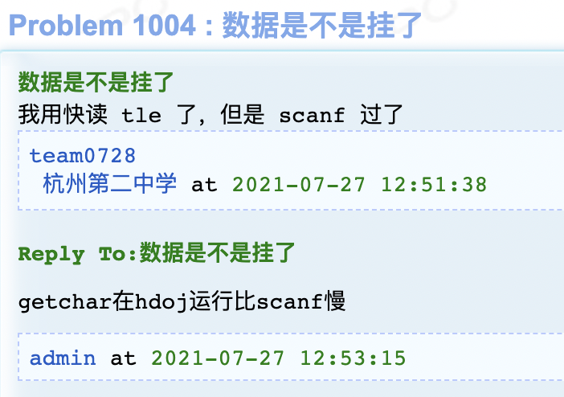

---
hide:
  - toc
---

# [2021HDU暑期多校第三场](https://acm.dingbacode.com/contests/contest_show.php?cid=986)

| 排名   | 当场过题数 | 至今过题数 | 总题数 |
| ------ | ---------- | ---------- | ------ |
| 66/750 | 5          | 11         | 12     |

## **A**

**upsolved by JJLeo**

### 题意

给出一棵 $n$ 个节点的树，每个节点有一个商品，价格为 $p_i$。

$q$ 次询问，每次给定树上一条路径，初始携带 $m_i$ 元，走到一个点如果钱就够就买一个商品，如果不够就不买，问最后剩多少钱。

($1 \le n,q \le 10^5$，$1 \le p_i,m_i \le 10^9$)

### 题解

首先将所有询问离线，并拆分成从下往上走 (到 lca) 和从上往下走两部分。

考虑先全部处理出每个询问走到 lca 时还剩多少钱，再全部处理出每个询问从 lca 走到终点还剩多少钱，下面以向上走为例：

重链剖分，将每个询问分割为 $O(\log n)$ 段重链，标记每段开始和结束的位置。逆序枚举 dfn 序，到了一个点先将这个点开始的所有询问加入数据结构，然后将数据结构中所有值 $\ge m_i$ 的全部减少 $m_i$，然后将这个点结束的所有询问移出数据结构，由于重链的 dfn 序是连续的，这样做可以保证正确性。

考虑使用 FHQ-Treap，所有询问按照其值排序，对于一次操作：

- 对于所有 $<m_i$ 的元素，不需要进行操作。

- 对于所有 $\ge m_i$ 的元素，分裂后不能直接打标记，因为合并时要保证其中一颗元素都小于另一颗，减去 $m_i$ 后可能会小于之前 $<m_i$ 的元素，考虑如下的 trick：

  > - 对于 $[m_i,2m_i)$ 的元素，将其分裂出来暴力一个个把权值减了再插回去，这样做一次会使得其值减少一半，因此对于每个询问至多会被执行 $O(\log p_i)$ 次。
  > - 对于 $\ge 2m_i$ 的元素，其减去 $m_i$ 也不会小于之前 $<m_i$ 的元素，直接打标记即可。

取出一个元素可以通过记录每个节点的父亲得到对应点的排名，从而使用对于 size 的分裂将其取出。

向下走和向上走是完全类似的，只不过初值变了，且改为正序枚举 dfn 序。总时间复杂度为 $O(n \log ^ 2 n)$。

## **B**

**upsolved by 2sozx JJLeo**

### 题意

给定一颗 $n$ 个节点的树，一共有 $m$ 个人，每个人固定一个起点，有三个旅行方案，每个方案有各自的终点和各自的代价，问是否可以让每人选一个方案使得所有人经过的路径不相交，如果可以最小化代价之和。($1 \le n \le 2 \times 10^5$，$1 \le m \le 10^5$)

### 题解

赛时做法：

> 忘了。

可惜最后没时间了，没写完，经典赛后过题。

## **C**

**solved by JJLeo**

### 题意

给定两个串 $s,t$，问 $t$ 和多少个 $s$ 的子串至多有 $k$ 个不同的字符，对 $k=0,1,2,\ldots,|t|$ 给出答案。

字符集为 `0` 到 `9`，同时还有一个通配符。($1 \le |t| \le |s| \le 2 \times 10^5$)

### 题解

字符集很小，很经典的 FFT 套路题，枚举每个字符，相应位置设为 $1$，否则是 $0$，卷起来即可得到每个位置的匹配数量。

对于通配符，也将其设为 $1$，但是两个通配符匹配会被算 $10$ 遍，因此再单独对通配符做一次匹配，也就是只将通配符的位置设为 $1$，减去 $9$ 倍的这个值即可。

## **D**

**solved by 2sozx Bazoka13 JJLeo**

### 题意

$\sum$ 签到，虽然是签到，但是 HDU 不能有快读和 `fread()`！

### 题解

因为这题罚时裂了，离谱 HDU $\sum$ 好吧。

## **E**

**upsolved by JJLeo**

### 题意

平面有向图，$1$ 能到所有点，所有点都能到 $n$，每个点有一个权值，选一些点最大化权值之和，要求所选点任意两个点都不可达，多解要求所选点的字典序最小。($1 \le n \le 10^5$)

### 题解

需要利用平面图的性质，从 $1$ 开始分别顺时针和逆时针 dfs 所有点，记每个点的出栈序为 $a_i,b_i$，则 $i$ 可以到达 $j$ 当且仅当 $a_i > a_j \land b_i > b_j$。

> 充分性显然，$i$ 如果可以到达 $j$ 那么不管如何 dfs，前者出栈序必然大于后者。
>
> 必要性则考虑其逆否命题，如果 $i$ 不可达 $j$，要么 $j$ 可达 $i$，那么 $a_i < a_j \land b_i < b_j$；要么 $j$ 不可达 $i$，如果 $a_i > a_j$ 那么把遍历顺序反过来即 $b_i < b_j$，反之亦然。从而如果 $i$ 不可达 $j$ 则 $a_i > a_j \land b_i > b_j$ 不成立。

因此将点按 $a_i$ 排序后相当于求权值最大的 $b_i$ 降序子序列，如果不要求字典序最小直接树状数组 $O(n \log n)$ 就可以求。每个选点方案等价于一个 $01$ 串，因此可以用动态开点线段树存储，每次只会新增一个点，比较时在线段树上二分，找到第一个不同的位置即可得到大小关系，因此可以在 $O\left(n \log ^2 n\right)$ 的复杂度内完成。

一个小 trick 是，相比去年 claris 那场 hdu 多校类似用动态开点线段树存方案的题，这里不需要维护哈希值，因为对于 $01$ 串每个位置，最多只添加一次，因此两个节点不同等价于它们对应的串不同。

## **F**

**upsolved by JJLeo**

### 题意

两侧各 $n$ 个点，$n^2-m$ 条边，左侧点权值为 $a_i$，右侧点权值为 $b_j$，一条边的边权为 $a_i+b_j$，求匹配数为 $1,2,\ldots,n$ 的最大权匹配。($1\le n \le 4000$，$1 \le m \le 10000$)

### 题解

考虑模拟费用流，每次增广一个单位流量，将左侧点按权值从大到小排序后，依次选择能从源点到达的 (也就是还没有被匹配的) 进行 bfs，对右侧每个还能到达汇点的点记录最先被哪个左侧哪个点能到达 (不是多源 bfs，遍历完一个起点再加入下一个起点，每个点只遍历一次)，这样就可以得到目前这个点可以匹配的最大权值，遍历所有右侧点取最大的权值将其作为这次的增广路，将权值加入答案，同时模拟网络流改变增广路上的容量，并为其增加反向边。

需要注意的是这题是以补图的形式给出的，需要使用补图 bfs：

> 将目前没经过的点存入链表，每次遍历链表尝试从当前点到达，如果不存在这条边则跳过，否则将该点从链表中删除并到达该点。
>
> 因为只有 $O(m)$ 条边没有，所以跳过的时间复杂度为 $O(m)$，总时间复杂度为 $O(n+m)$。

需要注意本题中链表中只能存放右边的点，右边到左边的边可以通过当前的匹配情况得知，如果加入复杂度就不对了。一共增广 $O(n)$ 次，每次时间复杂度为 $O(n+m)$，总时间复杂度为 $O(n^2+nm)$。

## **H**

**upsolved by **

### 题意

### 题解

## **I**

**solved by 2sozx JJLeo**

### 题意

$n \times n$ 的格子图，从左上走到右下，只能往下或往右，每个格子有两个权值 $a_{i,j}$ 和 $b_{i,j}$，最终权值为经过所有格子的 $\left(\sum a_{i,j}\right)\left(\sum b_{i,j}\right)$，最大化这个权值，保证数据随机。($1 \le n \le 100$)

### 题解

随机乱搞，每个状态记录约 $100$ 个当前 $\left(\sum a_{i,j}\right)\left(\sum b_{i,j}\right)$ 最大的状态就可以通过了。

## **J**

**upsolved by JJLeo**

### 题意

$n$ 个点 $m$ 条边的无向图，每条边有两个权值 $c_i$ 和 $d_i$，分别为正常权值和折扣权值，问恰好使用 $0,1,\ldots,n-1$ 条折扣权值的最小生成树的权值和。($2 \le n \le 1000$，$n-1 \le m \le 2 \times 10^5$，$1 \le d_i \le c_i \le 1000$)

### 题解

拆成 $2m$ 条黑白边，显然原本的一条边拆成的两条边不会同时被选，因此问题等价于恰好选 $k$ 条黑边的最小生成树，这是 wqs 二分的入门题。

注意边权很小，这意味着这个下凸函数相邻两点的斜率绝对值也不会很大，可以直接将斜率 $[-1000,0]$ 能切到横坐标最小 / 最大的点算出来，最小就优先选白边，最大就优先选黑边，设为 $[l,r]$，那最终选 $[l,r]$ 条黑边的答案就可以得到了，显然最终遍历所有斜率那么可以覆盖横坐标为 $[0,n-1]$ 的所有整点。

设 $c=1000$，这样需要算 $c$ 次 $O(m \log m)$，可以先各自对黑边白边做一次最小生成树，那么只有这些边才可能被用上，可以将边数减少到 $O(n)$。总时间复杂度为 $O(cn \log n+m \log m)$。

## **L**

**upsolved by JJLeo**

### 题意

$n$ 个数 $a_1,a_2,\ldots,a_n$，相邻数不能同时选，下标之差为 $k$ 的数不能同时选，且至少选一个数。一个方案的权值是所有选了数的乘积，求所有方案权值的和。($2\le k < n \le 300$)

### 题解

考虑两个算法：

- 算法一：直接记录前 $k$ 个元素的选择情况，从左往右扫一遍，时间复杂度为 $O\left(n2^k\right)$。
- 算法二：将序列变成一个 $k \times \left\lceil\dfrac{n}{k}\right\rceil$ 的矩阵，第 $i$ 个位置在 $\left(i \bmod k,\left\lfloor\dfrac{i}{k}\right\rfloor\right)$ 处 (0-indexed)，强行钦定最后一列从下往上 $k  \left\lceil\dfrac{n}{k}\right\rceil-k$ 个位置不能放数。那么这个矩阵上下左右四个位置不能同时放数，同时最后一行第 $i$ 列和第一行第 $i+1$ 列也不能同时放数，因此记录第一行的摆放情况以及当前的轮廓线 (第一次知道这个 dp 原来这个也叫轮廓线)。具体来说就是假设 dp 到第 $i$ 行第 $j$ 列，那么状态就是第 $i$ 行前 $j$ 个位置是否放数以及第 $i-1$ 行前 $j$ 个位置是否放数，最后利用最后一行和第一行的状态判断是否合法，时间复杂度为 $O\left(n2^{\frac{2n}{k}}\right)$。

利用根号分治，时间复杂度可以达到 $O\left(n2^{\sqrt{2n}}\right)$，但还是太慢了，注意到所有的二进制状态一定是独立集，数量是斐波那契数列，约为 $O\left(1.618^k\right)$，因此 dfs 出所有状态即可将复杂度降为 $O\left(n1.618^{\sqrt{2n}}\right)$。

## **记录**

0h：开始分题，看K签到ZYF冲，然后CSK看G签到留着给ZYF写，写完了有人过D了，MJX、CSK看着也是道sb题，CSK冲D，T了一发，然后开始了罪恶的垃圾HDU测评机器。

1h：ZYF去冲C，秒过，继续卡死D，把STL全换了，加上快速读入还是T，把排序优化还是T，加上fread后WA了，觉得是算法有点问题。

2h：想了想I，说是数据随机，MJX想就乱搞一下大概就行，喂给ZYF，ZYF WA了一发换了个乱搞方法就过了，然后过了。翻了翻Clarification。

换成scanf过了，HDU还不支持fread，西内！

3h：想了那个最小生成树和类似费用流的那题，没想出来，挂机一小时。

4h：想了个B的解法，看起来很对，ZYF冲了，没冲完，不知道哪有问题，寄了寄了。

## **总结**

- MJX：B最后破案了，当时问ZYF那个查询是单点的么，其实不是，下次不清楚的一定要问好，最后时刻太紧张了很容易写错。

## **Dirt**

D(+10)：HDU是逆天 I(+1)：换了个乱搞算法，没啥办法:sob:

