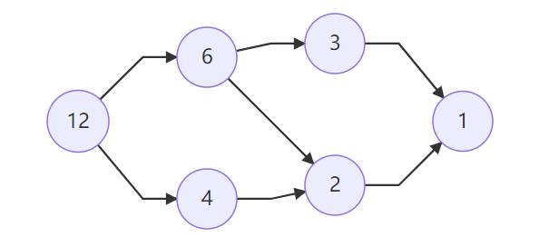

# [2021牛客暑期多校第六场](https://ac.nowcoder.com/acm/contest/11257)

| 排名    | 当场过题数 | 至今过题数 | 总题数 |
| ------- | ---------- | ---------- | ------ |
| 37/1100 | 5          | 11         | 11     |

## **A**

**solved by Bazoka13**

### 题意

给你一堆半平面以及半平面的移动方向，每秒半平面会向这个方向移动一个单位，$q$ 组询问，每组询问时间 $t$ 后半平面交的面积。$n\le 10^3, q \le 10^5, t\le 10^5$

### 题解

我们会发现随着时间的增加，半平面中有的边就会被缩成一点，因此我们可以 $O(n^2\log)$ 预处理出来哪些时间节点半平面会被缩小一点。对于每个询问我们就可以 $O(\log)$ 确定他此时的半平面的的形状。由于在这个时间里不会有缩点的情况，因此我们可以让每个边暴力向里缩一个矩形，再减掉与相邻边形成的四边形面积即可。

## **B**

**upsolved by JJLeo 2sozx**

### 题意

给定一个图，每条边有个出现概率 $P_i = q_i + (p_i - q_i)a^{-(t-1)}, pj \not = q_j (mod\ 998244353)$ 。

询问 $[1, t]$ 时原图的生成树个数的期望和是多少。$n\le 300, m \le \frac{n(n - 1)}{2}, a\le10^8, t\le 10^8$

### 题解

考虑矩阵树定理，将每条边的概率等价于数，令 $x = a^{-(t-1)}$，因此我们可以得到一个关于 $x$ 的矩阵，求出此矩阵的特征多项式即可根据不同的 $t$ 快速求得答案。

考虑将矩阵转化成上海森堡矩阵，记录转移的变换矩阵 $C$。对于上海森堡矩阵可以在 $O(n^3)$ 内求得特征多项式，对于 $C$ 单独求出行列式，乘起来即可。

此题 corner case 不少，等比数列求和时注意公比是否为1，并且 $m = 0$ 时按照题意的定义是没有生成树的。

## **C**

**upsolved by 2sozx**

### 题意

$n$ 个点的完全图，每次可以删除一个三元环，问怎么删能让剩余的边小于 $n$ 条。$3\le n \le 2000$

### 题解

删掉所有 $i + j + k \equiv 0 \bmod n, 1 \le i < j < k\le n$

证明：

- $i + j + k = n$ 时
  $$
  \sum_{i = 1}^{\lfloor\frac{n}{3}\rfloor}\lfloor\frac{(n - 3 * i)-1}{2}\rfloor
  $$

- 

- $i + j + k = 2n$ 时
  $$
  \sum_{i = 1}^{\lfloor\frac{2n}{3}\rfloor}\lfloor\frac{(2n - 3 * i)-1}{2}\rfloor - \sum_{k = n + 1}^{2n - 3}\lfloor\frac{(2n - k)-1}{2}\rfloor
  $$

- 易证这两个条件下 $(i, j, k)$ 一定不相等

## **D**

**upsolved by JJLeo 2sozx**

### 题意

一个数开始为 $0$ ，每次随机选择一个 $y\in[0, n]$，如果 $x\oplus y > x$ ，则 $x = x\oplus y$ ，否则 $x$ 不变，当 $x = n$ 时停止操作，问期望操作多少次。

$n = 2^k - 1$ ，每个数的概率通过题目给出，答案 $\mod 10^9 + 7$。

### 题解

考虑一个推期望的式子

$$
E(x) = (E(x) + 1)S(x) + \sum_{x\oplus y > x} (E(x\oplus y) + 1)p_y\\
S(x)=\sum_{i \le x} p_i
$$
化简可以得到

$$
E(x) = \dfrac{1 + \sum_{x\oplus y > x} E(x\oplus y)p_y}{1 - S(x)}
$$

答案可以通过 $cdq$ 分治计算，对于一层的计算，首先计算右半的答案，然后用 $FWT$ 转移到左侧即可。

## **E**

**upsolved by JJLeo 2sozx**

### 题意

起始有一个数根，每次操作选择一个节点 $u$ 生成一个颜色为 $c$ 的叶子结点，或者询问节点 $u$ 子树中颜色为 $c$ 的节点个数，强制在线。$c, q\le 5\times 10^5$

### 题解

考虑转化成序列问题，每个点有一个值域区间和他自己的一个值，类似于 $dfs$ 序的东西，向一个节点添加叶子即位向一个区间添加一个子区间。将整个区间映射到 $long\ long $ 值域内，我们可以得到每个节点的区间，为了防止某条链过长，我们使用替罪羊树进行操作，随时进行重构。

询问颜色时我们会发现在替罪羊树上我们每个节点相对位置重构前后没有变化，因此我们只需要对每个颜色维护一个平衡树，每次加点的时候向对应颜色的平衡树加点即可。查询即可使用类似 $dfs$ 序子树查询的操作。

## **F**

**solved by JJLeo 2sozx Bazoka13**

### 题意

西内

### 题解

西内

## **G**

**solved by JJLeo 2sozx**

### 题意

对于数 $i$ ，令 $p_j$ 为其所有质因子，$i$ 会向 $i / p_j$ 连边。问以 $1\sim n$ 为起点的图的变数和为多少，$n\le10^{10}$。示例图如下。

### 题解

考虑每个点 $i$ 他所连出去的边 $f(i)$ 对答案的贡献，据此推出答案的式子，如下
$$
\sum_{i = 1}^{n} \lfloor\dfrac{n}{i}\rfloor f_i
$$
由于 $\lfloor\dfrac{n}{i}\rfloor$ 我们是要进行整数分块的，因此需要计算 $\sum\limits_{i = l}^{r} f_i$ ，考虑枚举质因数对于 $i\in [l, r]$ 的贡献，我们会发现这依然是一个整数分块，以及需要 $min25$ 筛快速计算一个区间的质数的个数，这样我们就能达到一个 $O(n^{3/4})$ 的复杂度的算法。

考虑预处理前 $sqrt(n)$ 的质因数前缀和，即可将复杂度优化到 $O(n^{2/3})$。

## **J**

**upsolved by JJLeo 2sozx**

### 题意

一个图，如果联通块个数为奇数，则这个联通块 $C$ 贡献为 $-\sum\limits_{i\in C}a_i$ ，否则贡献为 $\sum\limits_{i\in C}a_i$，可以任意删除边，问总体最大贡献是多少。$n\le 10^6, a_i\le 10^9, m\le 10^6$

### 题解

联通块大小为偶数的不用考虑。

联通块大小为奇数时，我们可以证明一定只删除一个点最优。考虑删除哪个点，如果点非割点，则可以任意删除，否则看这个割点链接的其余联通块是否全为偶数，如果全是偶数则可以删除，否则不可以删除，复杂度为 $O(n)$。

判断割点其余联通块是否为偶数时可以在 $tarjan$ 判断割点的时候直接进行判断。

## **K**

**upsolved by JJLeo 2sozx**

### 题意

一棵树，每次询问一条链，不可以选择相邻的点的权值和最大是多少。$n \le 5 \times 10^5, m\le 10^7$

### 题解

这个问题显然可以用线段树做，然后用熟练剖分合并，复杂度是 $O(m\log^2)$ ，但是此题 $m$ 过大，显然是要 $O(1)$ 询问。

我们考虑使用猫树，而猫树需要一个 $\log$ 层的数据结构，因此我们可以使用点分树，因此每次询问可以直接求出两个点 $u, v$ 在点分树上的 $lca$，用猫树 $O(1)$ 合并即可，显然求 $lca$ 要用 $ST$ 来做。总复杂度为 $O(n\log + m)$

## **记录**

0h：开始看I，ZYF想了想直接秒了，看大家都过了F，CSK ZYF看F，MJX看H，想了半天F，不会做，CSK开始直接冲A的板子暴力，MJX喂ZYF H，ZYF直接开写扫描线开冲。CSK数组开小了，然后发现暴力确实会T(只能说几何常数起飞)。ZYF写完WA了，开始De

1h：ZYF和MJX观察ZYF代码，太tm对了，MJX开始写垃圾对拍，虽然对拍完全不对，但是找到了错误的数据(x).CSK改了改常数继续冲A模板暴力。ZYF发现nm输出反了，寄！

2h：自闭F，ZYF写了个完全假的F，然后开始和出题人对线

3h：前半小时继续对线，后半小时开始换题，考虑G，MJX和ZYF开始疯狂讨论，搞了个式子出来，不会优化。然后开始测暴力的复杂度(x.ZYF突然想到直接前$n^{2/3}$ 预处理复杂度就完全正确了，直接开冲。

4h：ZYF过了，然后发现F太傻逼了，CSK继续改A，ZYF先写F，直接过了。开始二分A的范围，冲冲冲！

## **总结**

输出一定不要反

MJX对拍写的准点（x

## **Dirt**

A(+10)：开始给了两发暴力，常数大寄了，数组还开小了，然后二分的返回值错了，但是过了大多的样例，最后TLE因为二分次数太多了(罚的好啊，+100都行)

H(+1)：经典x, y写反了

