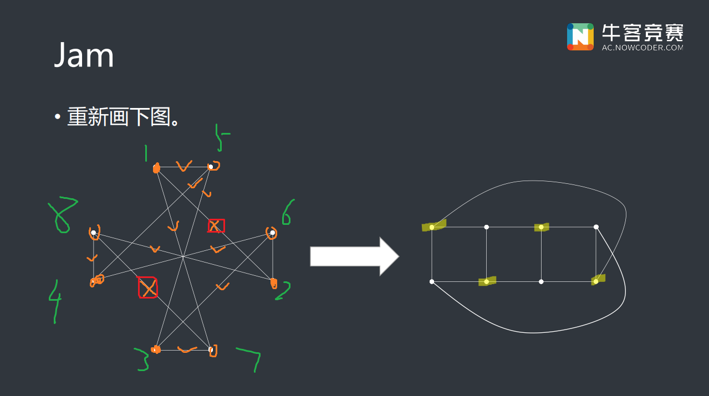

---
hide:
  - toc
---

# [2021牛客暑期多校第九场](https://ac.nowcoder.com/acm/contest/11260)

| 排名    | 当场过题数 | 至今过题数 | 总题数 |
| ------- | ---------- | ---------- | ------ |
| 58/1238 | 3          | 10         | 10     |

## **A**

**solved by 板子**

### 题意

类欧几里得板子

### 题解

板子按道理大概不能过(?，但是过了，std解法待学习

## **B**

**upsolved by JJLeo**

### 题意

给定一个 $n$ 点 $m$ 条边的无向图，其一个子图 $G$ 是一个 $k$ 度子图当且仅当：

- $G$ 每个点的度数至少是 $k$。
- $G$ 是连通的。
- $G$ 是极大的，也就是说 $G$ 不是任何一个其它 $k$ 度子图的子图。

一个 $k$ 度子图 $G$ 的权值是 $M \times m(S)-N \times n(S)+B \times b(S)$，其中 $M,N,B$ 是给定的常数，$m(S)$ 是子图内边数，$n(S)$ 是子图内点数，$b(S)$ 是恰有一个点在子图内的边数。

求权值最大的 $k$ 度子图，若有多个，最大化 $k$。($1 \le n,m \le 10^6$，$-10^9 \le M,N,B \le 10^9$)

### 题解

看到 $M \times m(S)-N \times n(S)+B \times b(S)$ 这种毫无规律的线性组合式，以及和 $M,N,B$ 的离谱数据范围，可以盲猜合法的 $G$ 的数量是在可遍历范围内的。

$G$ 的连通性和极大性保证了这一点，容易发现一个 $K$ 度子图一定是 $k$ 度子图的子图 ($K>k$)，因此我们类似拓扑排序，从小到大遍历 $k$，每次将所有度数 $<k$ 的点删去，更新与其相连点的度数，保证当前点度数 $\ge k$，设一个点 $i$ 在遍历到 $k$ 时被删去，将其权值 $a_i$ 设为 $k-1$。

将每个点以权值从大到小排序，相同随意给一个顺序，则每个点有一个唯一排名。从大到小遍历 $k$，每次将权值为 $k$ 的点加入，将其与周围已经加入的点连通，用并查集维护，则此时每个连通块正是所有可能的 $k$ 度子图。

考虑每个连通块的权值，点数很好维护，正好启发式合并就记录了；对于 $m(S),b(S)$ 可以将权值分给每个点。设一条边两端为 $(i,j)$，$i$ 的排名靠前，则其对 $m_i$ 的贡献为 $0$，对 $m_j$ 的贡献为 $1$，也就是说等后加的那个点加了这条边才算；其对 $b_i$ 的贡献为 $1$，对 $b_j$ 的贡献为 $-1$，也即后面那个点每加的时候这条边对 $b(S)$，加了后其在子图内就没有贡献了。

这两个值也可以用并查集维护，记得合并的时候只和排名比自己靠前的点进行合并，否则就把不该合并的点合并进来了。

## **C**

**upsolved by 2sozx**

### 题意

$n$ 个点，第 $i$ 个点位于 $(0, a_i)$ ，要移动到 $(i, 0)$ ，每个点只能向右向下移动，询问不相交路径数为多少。$n \le 10^5, a_i < a_{i + 1}, a_n \le 10^6$

### 题解

根据 LGV 引理可以知道我们要求的不相交路径数即为

$$
\left|
\begin{array}{ccc}
\dbinom{a_1 + 1}{1} & \dbinom{a_1 + 2}{2} & \cdots & \dbinom{a_1 + n}{n}\newline
\dbinom{a_2 + 1}{1} & \dbinom{a_2 + 2}{2} & \cdots & \dbinom{a_2 + n}{n}\newline
\vdots & \vdots & \ddots & \vdots\newline
\dbinom{a_n + 1}{1} & \dbinom{a_n + 2}{2} & \cdots & \dbinom{a_n + n}{n}\newline
\end{array}
\right|
$$

进行简单的化简可得到所求即为

$$
\frac{\prod\limits_{i = 1}^{n}(a_i + 1)}{\prod\limits_{i = 1}^{n}i!}
\left|
\begin{array}{ccc}
1 & (a_1 + 1) & \cdots & (a_1 + 1) ^ {(n - 1)}\newline
1 & (a_2 + 1) & \cdots & (a_2 + 1) ^ {(n - 1)}\newline
\vdots & \vdots & \ddots & \vdots\newline
1 & (a_n + 1) & \cdots & (a_n + 1) ^ {(n - 1)}\newline
\end{array}
\right|
$$

后面的行列式是范德蒙德行列式，即为 $\prod\limits_{1\le i < j \le n} (a_j - a_i)$ ，用 NTT 求即可。

## **D**

**upsolved by JJLeo**

### 题意

本题中，给定了一种按子树大小的边分治算法，称其为 $A$，规定在遇到多个可行中心时，优先选择节点与父亲节点最小值更小的那一个，若相等选择节点与父亲节点最大值更小的那一个。其它与正常边分治算法完全相同。

构造一个二叉树，点数不超过 $5000$，同时给定一种边分治方案，使得其比 $A$ 的递归层数少至少 $2$ 层。

最后一个点那一层也算一层，例如 $n=1$ 递归层数是 $1$。

### 题解

一条链分治起来递归层数是最少的，$n$ 个点的链递归层数是 $\left\lceil\log_2n\right\rceil+1$。

我们考虑诱导 $A$ 算法把链给拆了，考虑如下的构造：

类似斐波那契数列的构造方法，好多链串在一根棍上（x

我们的分治方案是，拆掉 $(22,55),(9,21),(4,8),(1,3)$ 这四条边，得到长度为 $55,21,8,4,1$ 的五条链，对于每个链此时的递归层数分别是 $1,2,3,4,4$，因此递归层数是 $7$。

对于 $A$ 算法，注意到 $34+55=89$，因此既可以切 $(55,56)$ 也可以切 $(22,55)$，我们通过序号大小钦定其切前者，这样就出来了一个长度为 $34$ 的链。依次类推有 $21+34=55$，每次让他只切一个小链出来，这样一直切下去递归层数是 $9$，正好多出来两个。

为了让 $A$ 算法不要去切 $(22,55)$，需要把所有点序号的大小顺序颠倒一下，只需让每个点序号 $i$ 变成 $90-i$。

## **F**

**upsolved by JJLeo**

### 题意

买卖股票，各需要买 / 卖 $a$ 股，买的时候要花钱最少，卖的时候要花钱最多。一共有 $240$ 天。

### 题解

单调队列优化多重背包裸题。

比赛的时候不写公式就写代码，浪费大量时间没调出来，我是脑瘫。

## **G**

**upsolved by JJLeo**

### 题意

一棵树 $n$ 个点，每个点有一个轮子，同时除了根节点每个点有一个相同的概率 $p$ 为回收站，每个轮子每次会向祖先移动一步，如果两个轮子撞到了一起 (在回收站撞了也不行），则这个总权值为 $0$，如果没有出现这种情况，总权值为所有轮子移动的路程和。特别地，根结点即 $1$ 一定是回收站，问期望权值为多少。

$n \le 5\times 10^5$

### 题解

赛时解法是纯概率 dp：

<del>MJX是nt，一堆 $1$ 都改了，就一个 $1$ 留着搁着搞笑呢。</del>

显然每个点不管是不是回收站，至多有一个儿子不是回收站，否则上来俩就在这撞了。

处理出每个节点子树中不算自己这个点不出现碰撞的概率 $\textit{ok}_i$，子树中不算自己这个点的期望权值 $f_i$，子树中算这个点延申上来的非回收站链长度 $\textit{len}_i$，之后就可以转移了。

设当前节点为 $u$，则每个子节点 $v$ 的子树有贡献除了要乘上每个子节点是否是回收站的概率，还要乘上其它子树的   $\textit{ok}_i$，否则其它子树撞了贡献就是 $0$。$f_i$ 和 $\textit{len}_i$ 的转移都是如此，如果 $v$ 不是回收站 (这样的 $v$ 至多一个)，那么它还会额外产生 $\textit{len}_v$ 的贡献。

想清楚了就好写，有一个 $1$ 没看出来只能说血亏。

正解是考虑其组合意义，相当于把树划分成数个不相交的向上的链，每个链链长为 $x$ 则贡献为 $\dfrac{x(x-1)}{2}$，相当于每个链选两个点的方案数，这就可以 dp 了。

## **I**

**upsolved by JJLeo**

### 题意

题面又臭又长，区块链都出来了，本质就是问这个问题：

> 从装有 $r$ 个红球、$b$ 个黑球的袋子中随机取出一球，记下颜色后放回袋中，并加进 $c$ 个同色球。如此共取 $n$ 次，则第 $n$ 次取得红球的概率是多少？

### 题解

概统原题。答案是 $\dfrac{a}{a+b}$。

## **J**

**upsolved by JJLeo**

### 题意

四个方向过马路，每个方向都有三种去其它三个方向的车，每次可以很多辆车一起走，但是不能撞车，问最少要走几次。

### 题解

可以发现右转一定行，最后和右转的最大值取 $\max$ 即可。

剩下一定是每次最多走两个，将能一起走的点连边，得到下图，发现不是二分图，但是删掉两条边就是二分图了，因此枚举这两条边的匹配量，之后无视这两条边跑网络流，每个点与源点 / 汇点相连边的流量就是其剩余车数，总车数减去最大流加上之前的匹配量即为答案。

## **记录**

0h：H是个看起来巨水的题，但是一时半会没想到，ZYF裂了冲向厕所，MJX开始乱写，写到ZYF回来还写寄了，ZYF重构过了。MJX看E是个巨水题直接写了，ZYF又裂了继续冲刺，MJX和CSK确认了一下直接写了。ZYF回来和ZYF确认个代码就交了。WA了，然后MJX sb了，主席树没新建节点。MJX想了想A推了一下发现是个大模板，直接开抄。

1h：快乐抄模板，期间CSK和ZYF讨论F，想了个完全正确的做法，准备写完A开始写。MJX抄完发现不对，然后仨人开始de，de半天发现MJX又没 init() ，拉出去击毙。交了一发WA了，发现插值的模板有 corner case 需要特判，改了就过了。

2h：ZYF开始写F，MJX开始和CSK想IG，I看半天不咋会，扔了，MJX推了个G的式子，MJX感觉老对了。CSK给ZYF做F数据，写半天一直没对，看没人过先过来搞G了。

3h：半天没调出来，发现MJX纯nt，没考虑条件概率之类的，就硬跑，完全不对，然后一顿改，终于过样例了，但是还是WA。开始双开de F和G

4h：感觉写的很对，但是不完全对，想看看clarification有没有啥东西，然后没看到I改了题意(淦)，挂机到最后(x)

## **总结**

## **Dirt**

